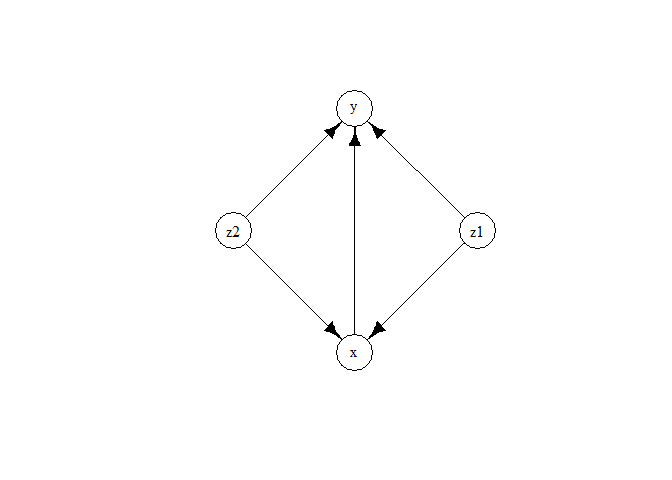

<!-- README.md is generated from README.Rmd. Please edit that file -->

# ExtremeGranger

<!-- badges: start -->

[](https://github.com/opasche/ExtremeGranger/actions/workflows/R-CMD-check.yaml)
<!-- badges: end -->

The ExtremeGranger R package is a framework for Granger causality in
extremes, designed to identify causal links from extreme events in
observational time series. Granger causality plays a pivotal role in
understanding directional relationships among time-varying variables.
While the task of causal discovery in time series gains heightened
importance during extreme and highly volatile periods, state-of-the-art
methods primarily focus on causality within the body of the
distribution, often overlooking causal mechanisms that manifest only
during extreme events. Our framework is designed to infer causality
mainly from extreme events by leveraging the causal tail coefficient. It
is especially helpful in the presence of hidden confounders. Our method
is non-parametric, can handle non-linear and high-dimensional time
series. The methodology was introduced in [Bodik and Pasche
(2024)](https://doi.org/10.48550/arXiv.2407.09632).

## Installation

To install the latest version of `ExtremeGranger`, in an R session, run:

``` r
# install.packages("devtools")
devtools::install_github("opasche/ExtremeGranger")
```

## Example

Here is an usage example with a 4-dimensional toy VAR time series with
`lag = 2`.

``` r
# Load the ExtremeGranger R package
library(ExtremeGranger)

# Load EnvStats for the example (or any other package that can generate Pareto noise)
library(EnvStats) 

# Example: Generating a 4-dimensional VAR time series with lag = 2
n <- 5000

set.seed(0) # for reproducibility
epsilon_x <- rpareto(n, 1, 1)
epsilon_y <- rpareto(n, 1, 1)
epsilon_z1 <- rpareto(n, 1, 1)
epsilon_z2 <- rpareto(n, 1, 1)
x <- rep(0, n)
y <- rep(0, n)
z1 <- rep(0, n)
z2 <- rep(0, n)

for (i in 3:n) {
  z1[i] <- 0.5 * z1[i - 1] + epsilon_z1[i]
  z2[i] <- 0.5 * z2[i - 1] + epsilon_z2[i]
  x[i] <- 0.5 * x[i - 1] + 0.5 * z1[i - 2] + 0.5 * z2[i - 1] + epsilon_x[i]
  y[i] <- 0.5 * y[i - 1] + 0.5 * z1[i - 1] + 0.5 * z2[i - 2] + 0.2 * x[i - 1] + epsilon_y[i]
}

# Running the extreme causality tests
z <- data.frame(z1, z2)
result_xy <- Extreme_causality_test(x, y, z, max_causal_lag = 2, p_value_computation = FALSE)
result_yx <- Extreme_causality_test(y, x, z, max_causal_lag = 2, p_value_computation = FALSE)

# Estimating the full causality graph
w <- data.frame(z1, z2, x, y)
G <- Extreme_causality_graph(w, max_causal_lag = 2)  # Try it out also with lag = 1. You will see that the lagged edges disappear
```

On can then use, for example, the `igraph` package for plotting the
estimated graph.

``` r
# Visualizing the final graph estimate using the igraph package
library(igraph)

graph <- graph_from_edgelist(G$G)
V(graph)$name <- names(w)
plot.igraph(
  graph, 
  layout = layout_nicely(graph), 
  vertex.label = V(graph)$name,
  margin = c(0, 0, 0, 0),
  vertex.color = "white",
  vertex.label.color = "black",
  vertex.size = 30,
  edge.color = "black"
)
```



## References

Bodik, J. and Pasche, O. C. (2024). “Granger Causality in Extremes.”
*ArXiv Preprint* 2407.09632.
[doi:10.48550/arXiv.2407.09632](https://doi.org/10.48550/arXiv.2407.09632).
